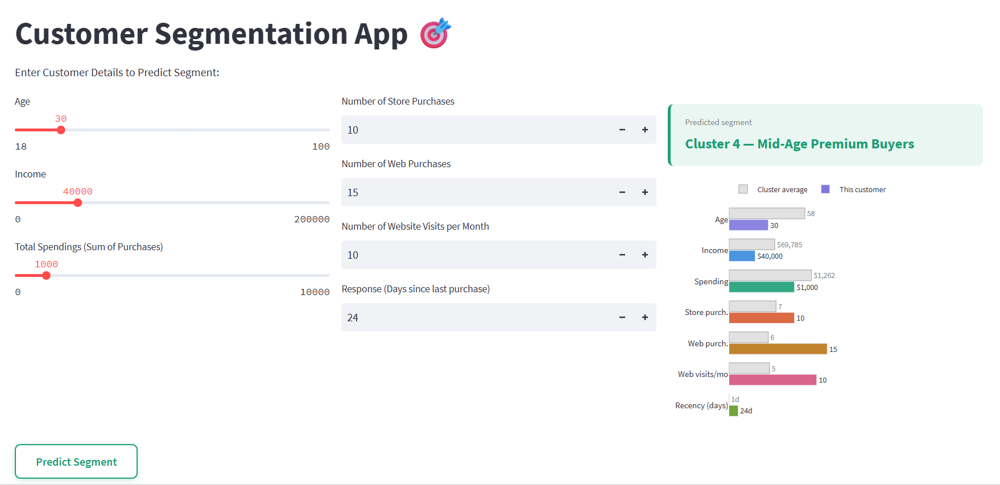

# 🎯 Customer Segmentation System Using Machine Learning

A machine learning-powered customer segmentation system that identifies distinct customer groups using **K-Means Clustering** and enables marketing teams to design targeted campaigns based on customer behavior, purchasing patterns, and engagement characteristics.

The project combines **unsupervised machine learning**, **customer analytics**, and an interactive **Streamlit dashboard** to transform raw customer data into actionable business insights.

---
## 📷 Application Preview



---

## 🚀 Live Application

🌐 **Streamlit App:**  
https://customer-segmentation-analysis-hk.streamlit.app/

---

# 📌 Business Problem

Marketing teams often treat customers as a single population, resulting in generic campaigns and lower conversion rates.

This project addresses that challenge by:

- Identifying natural customer groups using clustering techniques
- Discovering high-value customer segments
- Detecting low-engagement customers requiring retention strategies
- Supporting personalized marketing campaigns
- Enabling data-driven customer targeting

The result is a practical customer intelligence system that converts customer behavior data into actionable segmentation strategies.

---

# 📊 Dataset Overview

**Source:** Kaggle

**Records:** 2,500+

**Features:** 29

### Key Customer Attributes

- Age
- Income
- Education
- Marital Status
- Purchase History
- Product Spending Categories
- Number of Store Purchases
- Number of Web Purchases
- Website Visits
- Campaign Responses
- Customer Recency
- Customer Complaints
- Household Information

---

# 🛠 Machine Learning Pipeline

## Data Preparation

- Data Cleaning
- Missing Value Handling
- Feature Engineering
- Feature Scaling
- Outlier Analysis

## Feature Engineering

Created business-relevant behavioral indicators including:

- Total Customer Spending
- Purchase Activity Metrics
- Customer Engagement Indicators
- Recency-Based Features
- Campaign Response Features

---

## Clustering Algorithm

**Model:** K-Means Clustering

### Why K-Means?

K-Means was selected because:

- Highly effective for customer segmentation tasks
- Computationally efficient
- Produces interpretable customer groups
- Widely used in marketing analytics and CRM applications
- Enables actionable business segmentation

---

## Optimal Cluster Selection

The optimal number of clusters was determined using:

✅ Elbow Method

**Final Number of Clusters: 6**

This provided the best balance between cluster separation and business interpretability.

---

# 📈 PCA Visualization

Principal Component Analysis (PCA) was used to:

- Reduce dimensionality
- Visualize customer clusters
- Validate cluster separation
- Identify overlapping segments
- Detect anomalous customer groups

---

# 👥 Customer Segment Insights

## Cluster 0 — Mature Mid-Spenders

- Average Age: 49
- Income: ~$74K
- Moderate spending behavior
- Strong in-store purchasing activity

**Business Action:**
Cross-sell complementary products and loyalty programs.

---

## Cluster 1 — Older Digital Buyers

- Average Age: 60
- Income: ~$57K
- Lower overall spending
- Balanced online and offline purchasing

**Business Action:**
Target with personalized digital campaigns.

---

## Cluster 2 — Low-Income Low-Engagement Customers

- Lowest income segment
- Minimal spending activity
- Limited purchase frequency

**Business Action:**
Retention campaigns and promotional offers.

---

## Cluster 3 — Senior High-Income Buyers

- Average Age: 71
- High income
- Moderate spending behavior
- Store-oriented purchasing pattern

**Business Action:**
Premium offline engagement campaigns.

---

## Cluster 4 — Mid-Age Premium Buyers ⭐

- Average Age: 58
- Income: ~$70K
- Highest spending segment
- Strong online and offline engagement

**Business Action:**
Upselling, premium products, loyalty rewards, and targeted offers.

---

## Cluster 5 — Ultra-High Income Anomaly

- Extremely high reported income
- Very low spending behavior
- Statistical outlier

**Business Action:**
Requires additional investigation before campaign assignment.

---

# 💻 Streamlit Application

The interactive dashboard allows users to:

### Customer Profiling

Input customer information such as:

- Age
- Income
- Total Spending
- Store Purchases
- Web Purchases
- Website Visits
- Customer Recency

---

### Segment Prediction

The application automatically:

- Assigns the customer to a cluster
- Displays the predicted customer segment
- Highlights segment characteristics

---

### Customer vs Segment Comparison

Users can visually compare:

- Customer attributes
- Cluster averages
- Behavioral differences

This enables quick interpretation of customer positioning within the selected segment.

---

# ⚙️ Engineering Highlights

### Architecture

- Modular Codebase
- Reusable Components
- Separate Inference Pipeline
- Joblib Model Serialization

### Deployment

- Streamlit Cloud Deployment
- Lightweight and Responsive UI
- Real-Time Customer Classification

---

# 🧰 Tech Stack

### Machine Learning

- Python
- Scikit-Learn
- K-Means Clustering
- PCA

### Data Processing

- Pandas
- NumPy

### Visualization

- Plotly
- Matplotlib

### Deployment

- Streamlit
- Joblib

---

# 🎯 Business Impact

This solution demonstrates how unsupervised machine learning can be applied to real-world marketing challenges by:

- Improving customer understanding
- Enabling targeted marketing campaigns
- Identifying high-value customer groups
- Supporting retention strategies
- Driving data-driven customer engagement decisions

---

# 📂 Repository Structure

```text
├── assests/
│   └── Customer-Segmentation-App-Snap.png
├── artifacts/
│   ├── kmeans_model.joblib
│   └── scaler.joblib
├── main.py
├── prediction_helper.py
├── requirements.txt
├── README.md
└── LICENSE
```

---

# 🔮 Future Enhancements

- Automated Campaign Recommendations
- Customer Lifetime Value (CLV) Integration
- Interactive Cluster Exploration
- Advanced Behavioral Analytics
- Dynamic Segment Monitoring

Machine Learning | Data Science | Generative AI

Focused on building production-ready AI and analytics solutions that solve practical business problems.
